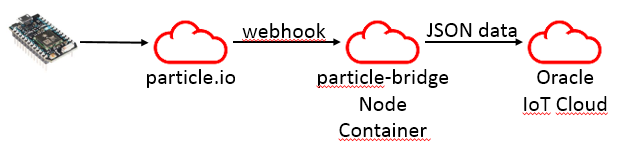
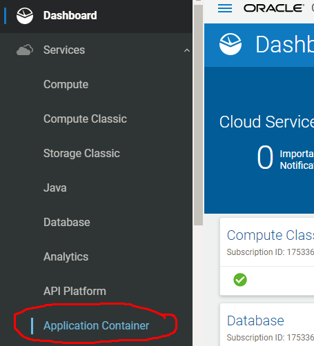
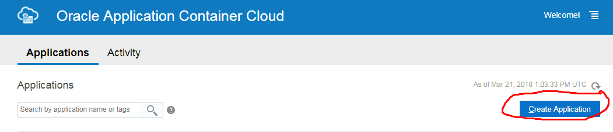
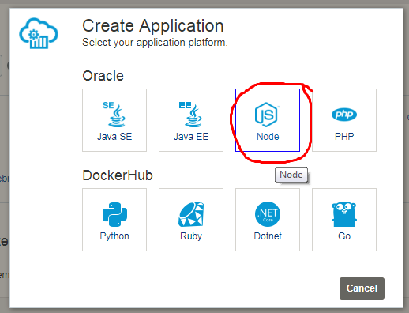
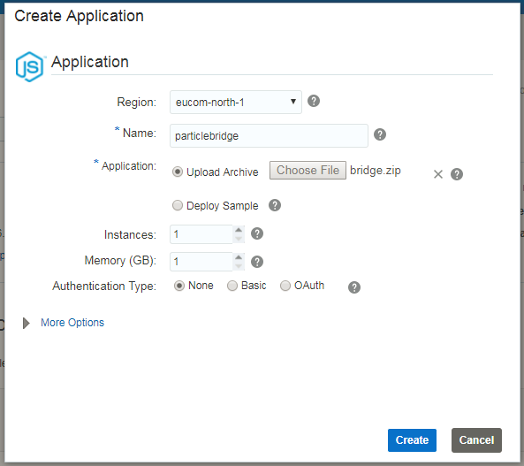
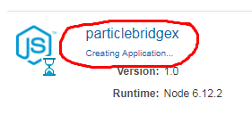

# particle-bridge
This is a bridge connecting device on Particle.io to Oracle IoT Cloud.
Works with any Node.js container.

## Pre-requisites ##
1. A working Oracle IoT Cloud instance.
2. Create particle datamodel to iotcs with 
+ curl (see "createDeviceModel"-scripts)
+ use iotcs UI, import particle-devicemodel.json

## Steps for Oracle Cloud ##
1. Edit particle-bridge.js: modify lines 10-12 with valid url & credentials
2. create a zip-file containing jsclient, node_modules, device-library.node.js, manifest.json, package.json and particle-bridge.js
3. Create a new application container of type Node.js, 1 cpu, 1 GB mem.
4. Upload the zip when asked

## Screenshots ##
1. 
2. 
3. 
4. 
5. 
6. All done!
